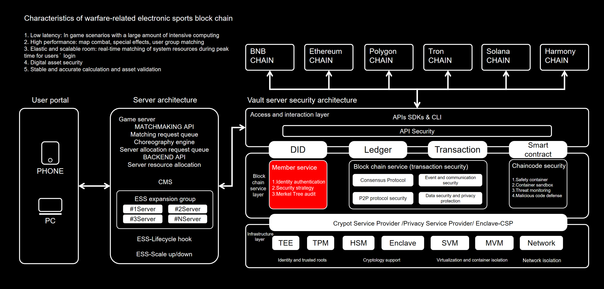

# 🚀 2. Technical Architecture

**2. Technical Architecture**

**2.1 Application of Block Chain Technology**

1\. Distributed Ledger Technology: Block chain games require the use of distributed ledger technology to record transactions and asset flows in the game, ensuring the safety and reliability of transactions in the game.

2\. Smart Contract Technology: Block chain games require the use of smart contract technology to implement game rules and logic, ensuring fairness and operability of the game.

3\. Encryption Technology: Block chain games require the use of encryption technology to protect user privacy and the security of game data.

4\. Consensus Mechanism Technology: Block chain games require the use of consensus mechanism technology to ensure the credibility and security of transactions and asset flows in the game.

5\. Cross Chain Technology: Block chain games require the use of cross chain technology to achieve interoperability and interaction between different block chains, improving the play-ability and interactivity of the game.

6\. Digital Asset Technology: Block chain games require the use of digital asset technology to achieve the issuance, trading, and management of virtual assets and currencies in the game.

&#x20;

**2.2 Architecture Design of Game System**

<figure><figcaption></figcaption></figure>

&#x20;

**2.3 Storage and Management of Game Data**

The storage and management of block chain game data is an important issue, as the security and reliability of game data are crucial for the operation and user experience of games.

Block chain game data storage and management methods:

1.Distributed Storage: Block chain game data can be stored through distributed storage technology, which can ensure the security and reliability of the data. Distributed storage can distribute data across multiple nodes, so that even if a node fails, it will not affect the operation of the entire system.

2\. Smart Contract: Smart contract is an important tool for data management in block chain games, which can be used to manage various data in the game, such as player information, game rules, transaction records, etc. Smart contract can automatically execute code to ensure the correctness and security of game data.

3\. Data Encryption: In order to protect the security of game data, data encryption technology can be used to encrypt game data. Even if the data is stolen, it cannot be decrypted, ensuring the security of game data.

4\. Data Backup: To prevent data loss, game data can be backed up regularly. Backups can be stored on multiple nodes to ensure data reliability.

5\. Data Synchronization: In order to ensure the consistency of game data, data synchronization technology can be used to synchronize game data. Data synchronization can ensure the consistency of game data between different nodes and avoid inconsistencies in data.

