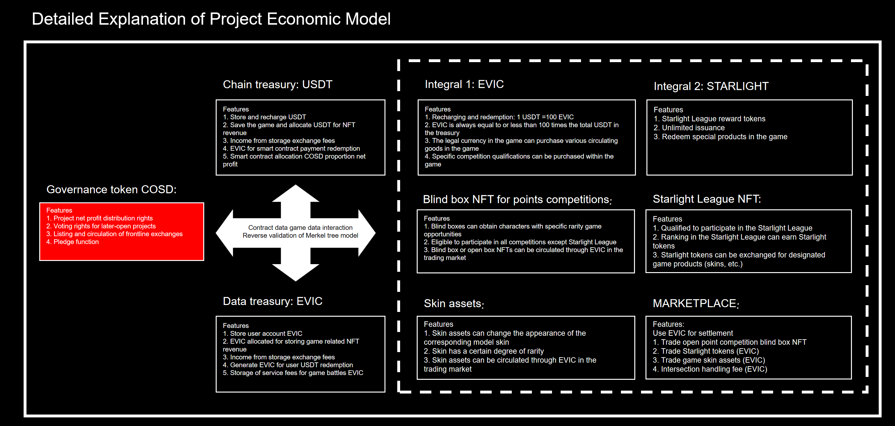
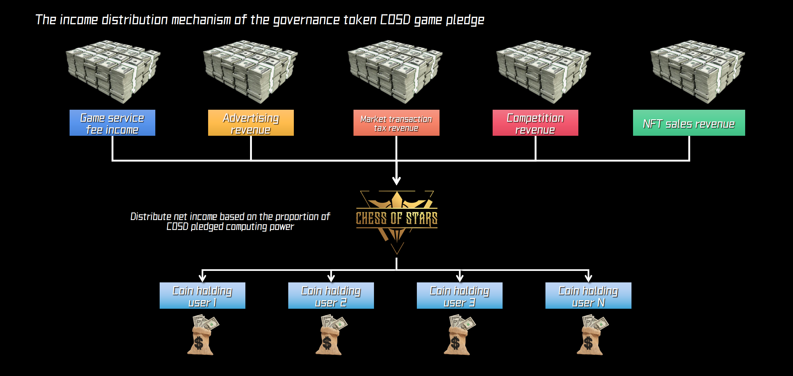
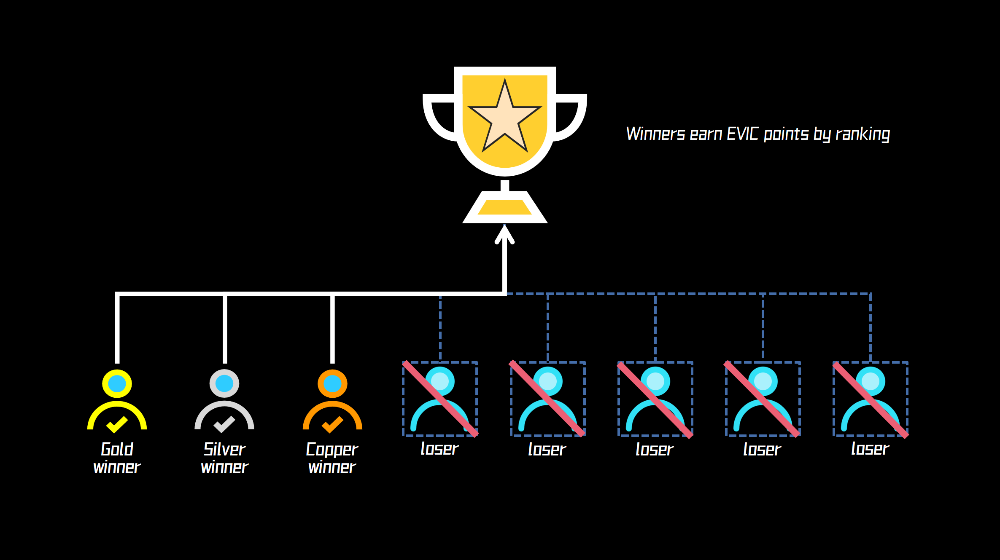
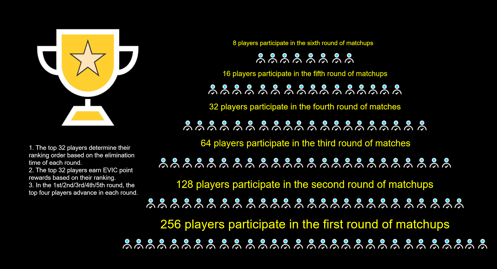
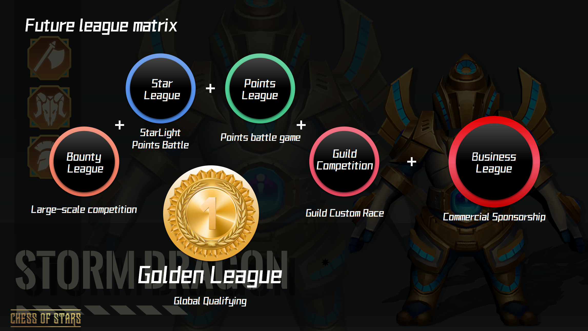

# 🪙 3. Economic Model

**3.1 Game Tokens and Points Design**

**Fungible token 1: COSD**

**Token definition: game governance token**

**Token name: COSD**

**Token issuance chain: multi chain**

**Total token issuance: 1,000,000,000 COSD**

**Token Attributes and Functions**

1\. As a settlement token for participating in net income distribution as a game project pledge pool

2\. Payment settlement tokens for NFT blind boxes (before landing on the exchange)

3\. Game operation voting rights

4\. Pledged tokens for qualifying for starlight league games

5\. Pledged tokens obtaining cub agent qualification

6\. Partial rewards tokens for club agents

&#x20;

**Analysis of Net Profit Distribution Through Token Pledge**

1\. The settlement token for pledging and distributing the net profit of the game project is: USDT

2\. The formula for pledging the net profit of game projects: current net profit=current total profit - current total costs

3\. The net profit cycle for pledge distribution game project: starting from the third natural month after the game is launched, each net profit cycle for pledge distribution game project shall not exceed three natural months.

&#x20;

**Profit Distribution Method**

1\. All pledge related sections in the Chess of Stars project are merged and calculated into the total pledge governance token pool participating in dividends.

2\. Project opening, pledge management, token collection, pledge distribution, and net profit of game projects determine the proportion of the pledged COSD token in the dividend calculation based on the duration of the game project's governance token pledge.

3\. Formula for calculating the dividends per cycle of the governance token pledge pool

(1) 1 COSD = 1 calculation power

(2) Pledge token calculation power of star league qualification, pledge token calculation power for club agents = pledge quantity \* 1

(3) Computing power calculation of governance token pledge pool

(4) Number of \[ledge governance tokens in the pledge pool \* period of current pledge governance tokens/total week of current pledge pool opening period = actual calculation power of the current pledge

(5) Total net profit/total actual calculation power = distributable profit per unit of calculation power

(6) Total actual calculation power = pledge token calculation power of star league qualification + pledge token calculation power for club agents + pledge pool token calculation power

(7) Customer’s total calculation power = pledge token calculation power of customer’s star league qualification + pledge token calculation power for customer’s club agent + customer’s pledge pool token calculation power

(8) Customer’s distribution profit = distributable profit per unit of calculation power \* total customer calculation power

&#x20;

**Source of Net Profit from Token Pledge Distribution**

1\. Game NFT sales revenue

2\. Game platform operating fee income

3\. Other operating income from games (advertising fees, game sponsorship, event promotion)

4\. Rental income from club rooms

&#x20;

&#x20;

**Fungible token 2: USDT**

**Token definition: stable currency**

**Token name: USDT**

**Token Attributes and Functions**

1\. The game’s official website is used for recharging and redeeming settlement tokens for EVIC points.

2\. The game’s official website is used to purchase stable coins for the governance token COSD (before logging into the exchange).

3\. The game's official website is used to purchase stable coins for extracting NFT blind boxes (before logging into the exchange to replace payment with the governance token COSD)

4\. The ratio of game recharge and redemption points is 1 USDT = 100 EVIC

5\. Each use of points to redeem USDT should not be less than 10 USDT

&#x20;

&#x20;

**Non fungible token 1: blind box NFT for points competitions**

**Token definition: designated NFTs participating in points competitions**

**Token Attributes and Functions**

1\. Blind box NFT for points competitions has an indicator of the number of times for participating in points competitions.

2\. Blind box NFT for points competitions will automatically open the box after purchase.

3\. Blind box NFT for points competitions can be circulated and traded after opening the box.

4\. After entering the game and losing NFT points in the blind box of points competitions

<mark style="color:yellow;">(Note 1: Attachment 1 provides detailed indicators of the open box burst rate and corresponding number of times for the blind box NFT for points competitions.)</mark>

Token issuance chain: multi chain

Token value: 99U

<mark style="color:yellow;">(Note 2: Attachment 1 provides detailed purchase conditions and associated time points for the blind box NFT for points competitions)</mark>

&#x20;

**Non fungible token 2: Starlight league NFT**

Token definition: qualification certification for participating in starlight league tournaments

Token Attributes and Functions

1\. By pledging a COSD with a value of 99USDT to qualify for the starlight league tournaments (there will be promotional preferential policies in the initial stage).

2\. Starlight league qualifications allow you to participate in starlight league with unlimited times and earn starlight points rewards by ranking in the top three places.

3\. Players with NFT qualifications in the starlight league can exchange their starlight points for corresponding game character skins.

4\. After withdrawing the pledged COSD, players lose their starlight league qualification and cannot use the starlight points in their game account.

&#x20;

**Integral 1: EVIC**

EVIC Crystal: abbreviated as E, as a universal point in the game, players can redeem and recharge through the official homepage for use in the game. In the game, E can participate in higher point reward battles and leagues in conjunction with the number of blind box NFTs in points competitions. Later on, it can also be used to purchase star points, props, and skins from other players in the game.

The Role and Attributes of Integral EVIC

1\. Obtained by player recharging USDT

2\. Winning through player’s participation in various points competitions

3\. Exchange for USDT on the official website

4\. Exchange ratio 1 USDT = 100 EVIC

&#x20;

**Integral 2: StarLight**

StarLight: referred to as SL, the reward points obtained through the StarLight league in the game can be exchanged for rare skins of chess characters in the game store. Meanwhile, Starlight can trade through EVIC.

The Function and Attributes of Integral StarLight

1\. Players compete in the Starlight league and win the top three spots to obtain

2\. 50 star points for first place obtains, 35 star points for second places, and 20 star points for third place

3\. A single account can earn up to 100 star points per day

4\. StarLight points can be redeemed for game skins within the game

&#x20;

Game assets: skins, maps, special effects, sound effects, etc

In the game, various skins, maps, special effects, and sound effects will gradually be enriched to improve the gaming experience and interactivity of Chess of Stars. At the same time, through block chain technology, we will transfer various game assets exchanged by players through Starlight points back to the online chain to generate NFTs for increase the liquidity and rarity of assets.

&#x20;

**3.2 Operation of Game Economy System**

<figure><figcaption></figcaption></figure>

&#x20;

&#x20;

**3.3 Game Revenue and Distribution Mechanism**

Revenue distribution mechanism for governance token COSD game pledge

<figure><figcaption></figcaption></figure>

Revenue distribution mechanism for Chess of Stars WEB 3.0 self-propelled chess game in points competitions.

EVIC point allocation mechanism for regular 8-person matches

<figure><figcaption></figcaption></figure>

EVIC point allocation mechanism for 256-person matches in the Bounty League

<figure><figcaption>
Note 3: The distribution indicators of points in the Bounty League can be found in Attachment 2
</figcaption></figure>

Future league matrix

<figure><figcaption></figcaption></figure>

