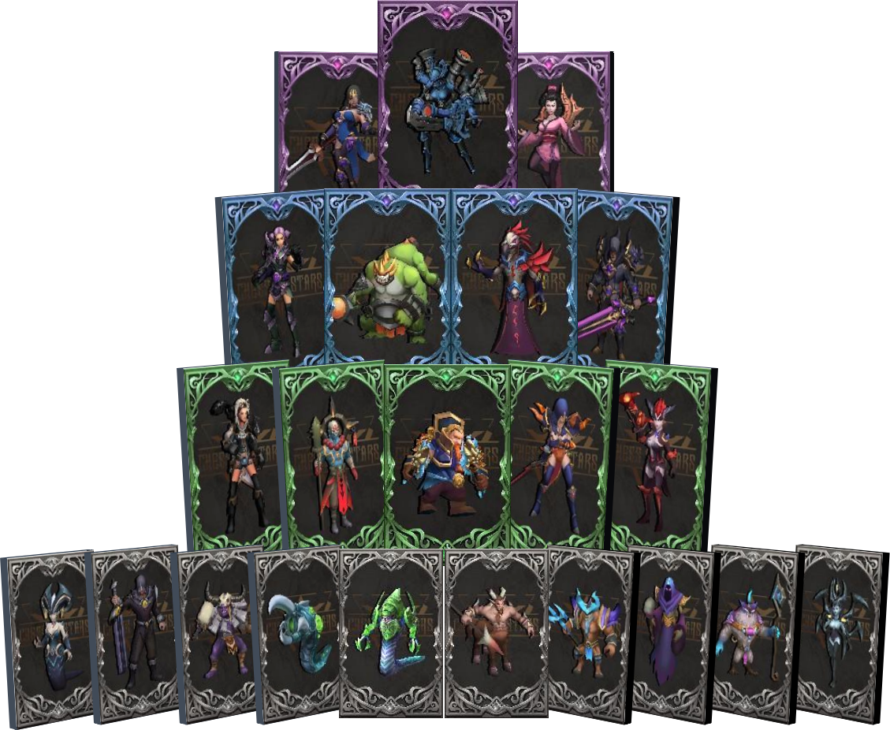

# ⚽ 5. Team Introduction

**5.1 Background and Experience of Team Members**

&#x20;

**CEO: Walter Heisenburg**

Introduction: with master's degrees in Economics, Business Administration, and Law from Texas A\&M University, as well as a bachelor's degree in Automation. More than 15 years financial assets experience in product research and development, design, marketing, and operational management, and served as a senior executive in multiple financial companies listed in the United States and Hong Kong. During the period of serving as a General Manager in a well-known private equity firm, he managed and controlled 18 private equity funds with a total scale of over 10 billion yuan, and invested in multiple dark horse enterprises. Continuously serving for many  renowned Wall Street investment banking institutions to provide year-round advisory services.

&#x20;

**CTO: Kirigaya Ryutaro**

Introduction: core developer of BonusCloud; contributor to OpenWRT plugin development; Formerly led the establishment of Rayark folk fans club; Previously worked in a studio under Sony and participated in the localization of multiple Sony PlayStation platform games; Design a remake of the Japanese women's oriented game "Tlicolity Eyes"; Japanese animation film promoter; Parami front-end chief engineer, UI/UX design; developed an auxiliary driving training system based on Geographic Information Navigation System (GIS).

&#x20;

**CMO: Oliver**

Introduction: with 20 years of rich experience in event organization, hosted and co-hosted hundreds of sports events worldwide, including planning and organizing EPT (European Poker Grand Prix) satellite matches and main matches in the European Indoor 5-player Football League, Asian 11-player Football League, and WSOP events worldwide. Promoted large-scale competitive events such as WSOP (World Series of Poker League) and WPT within Asia.

&#x20;

**Founding Team Members**

Former Senior Director of Finance and Risk Control at the head exchange, responsible for managing the market value of Chess of Stars

Former R & D team members of the HECO public chain at the head exchange, responsible for the partial development of the on-chain part of Chess of Stars

Renowned mentor of the university entrepreneurship camp at the head exchange, responsible for market operation of the Chess of Stars project

Former Tencent's overseas game research and development center is responsible for the game development and optimization of the Chess of Stars project. The head of legal affairs, government, and international relations for the top investment institution is responsible for the compliance management of the Chess of Stars project.

&#x20;

&#x20;

**5.2 Team Development and Growth Plan**

As the project develops, we constantly seek outstanding talents to join us. We establish a complete and efficient team that integrates game development, block chain development, smart contracts, game planning, game art, system architecture, security technology protection, marketing, and event management.

<figure><figcaption></figcaption></figure>
