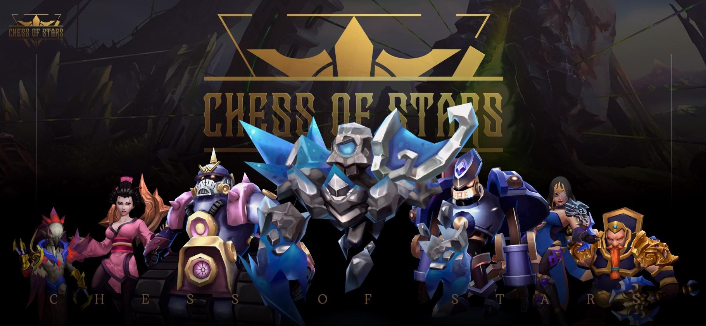

# ☀ 9. Future Development and Outlook of the Project

**Future Development and Outlook of the Project**

After experiencing a wave of gamefi, we believe that the application of block chain technology in games should be friendly to every participant, rather than speculative, and truly achieve equal opportunities for everyone in the face of decentralization.

We hope to introduce a brand new metaverse world to everyone through the game Chess of Stars, and establish a WEB3.0 game world that includes NFT, self-propelled games, real-time strategy, real-time battle, and high rewards through a balanced game system. Just give yourself a chance to challenge your opponents here, and you may change your whole life.

Chess of Stars is just the beginning, and of course, we all know the importance of taking the first step well.

We hope that this project will be a milestone in the WEB3.0 world. I hope my team, as well as those who support us and our players, can receive your own benefits from this WEB3.0 self-propelled e-sports game. And the Chess of Stars project can also become the most dazzling star in the industry.

<figure><figcaption></figcaption></figure>





&#x20;
