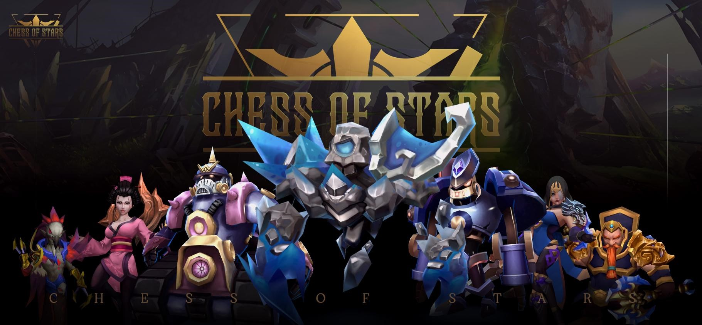

# ❤ Chess of Stars WEB 3.0 Electronic Sports Game  —— White Paper

<figure><figcaption></figcaption></figure>

**1. Project Overview**

**1.1 Background and Significance of the Game**

Chess of Stars is a self-propelled WEB 3.0 board game, which involves purchasing stable coins from various public chains and participating in a variety of battles using NFTs. Players can also participate in high point reward competitions by adding battle points to their stable coins. Faced with a thrilling eight-person real-time combat mechanism, unleash imagination and luck to create your own lineup and become the ultimate winner on the battlefield. In addition to continuing the classic traditional self-propelled chess game play methods, it has also added more exciting content such as rich league challenges.

Chess of Stars not only integrates the block chain Gamefi function in a reasonable way, but also demonstrates perfect gameplay. It will upgrade traditional games to WEB3.0 e-sports games by leveraging the value of digital assets. Chess of Stars will be released on mobile and PC platforms, where players will compete with players from various platforms. You will be the next king in the world of Chess of Stars.

&#x20;

**The Story Takes Place in A Completely New Universe**

&#x20;

The news spread like wildfire, and the existence of this treasure planet leaked out from a survivor's mouth, shocking the entire universe. For a moment, a shining mark appeared on the star map of various factions, and countless factions rushed in to compete for the crystal. Adventurers, speculators, private armed individuals, and individuals from all sides, guided by the forces behind them, unite, betray, and rebel, causing chaos to the once peaceful and remote planet. The undisturbed indigenous people rose up to resist, and the prolonged flames of war awakened the primitive and ferocious queen of the alien insects sleeping in the lava of the core of the earth. The swarm of insects crossed the volcano and flew to the ground, engaging in indiscriminate and crazy killing of all living creatures.

The overly bloody struggle gave Avik Crystal a new name: Blood Diamond. Chaos and strife continued for decades, only to be alleviated by the arrival of the army of spiritual gods. The spiritual leader, who was able to communicate with all races in consciousness, convinced several of the largest races and forces, including the queen of the Zerg, to stop this meaningless war for the benefit of all parties and instead use a more civilized form to divide up the wealth of this planet. Although the major leaders have seemingly accepted this agreement, they are still stirring up in private.

A great war is about to begin......

&#x20;

**1.2 Project Objectives and Vision**

As a WEB3.0 e-sports game, Chess of Stars will definitely bring a new experience to the single block chain ecosystem.

Firstly, our essence is a game that will have strong gameplay, a reasonable game financial model, rich e-sports competitions, high competition bonuses, a passionate player community, and will lead a new round of WEB3.0 revolution in e-sports game projects.

We hope to become a game that can pass the test of time in the WEB3.0 field and bring joy to our players. Through advanced WEB3.0 technology and spirit, we enhance the play-ability and sense of belonging of players, and achieve the appreciation of player assets through game props, points, and tokens. Build an open gaming community, prioritize the interests and needs of players, and jointly build a gaming experience for everyone through consensus.

&#x20;

**1.3 Project Features and Advantages**

Chess of Stars project is a real game.

Chess of Stars has no double-token financial model with inflation.

Chess of Stars has no participation threshold for players to transfer from WEB2 to WEB3.

Chess of Stars has e-sports genes.

Chess of Stars provides combat point rewards to achieve player value.

Chess of Stars will have a rich NFT skin collection experience and give NFT skin value.

Chess of Stars has rich and expandable commercial value.

Chess of Stars has rich community interaction topics.
