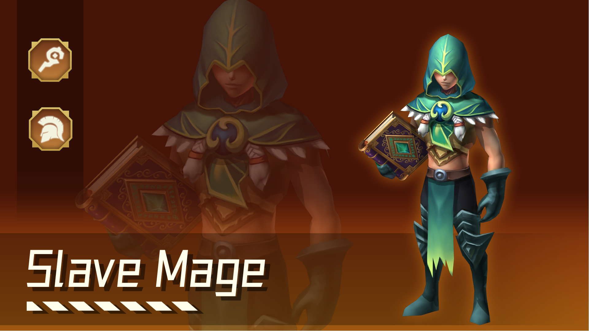

# Attachment Information 3

Introduction to Gameplay

In each game of Chess of Stars, eight players engage in a game where they fight their own battles. Players recruit troops, integrate heroes, enhance their combat power, arrange troops, and become the ultimate winner on the battlefield.

1\. Preliminary Preparation

Log in to the official website to purchase NFTs and obtain game counts

Redeem in-game tokens through wallet to purchase tickets/skins and other props in the game

Enter the game and choose different game modes to participate in practice matches, free matches, and bounty leagues.

Obtain through participation in free tournaments or participate in bounty leagues by purchasing tickets; The sessions are regular session, elite session, expert session, and master session, each with a capacity of 256 players

2\. Recruit/Engage Heroes

In the game, you will receive a certain amount of gold coins from every round. Gold coins can be purchased from the recruitment panel for heroes. The hero's price is divided into 1-2-3-4-5 gold coins, and the higher the cost is, the more powerful the chess pieces will be. When there is no suitable hero, you can also consume 2 gold coins to refresh. The lower your own level is, the higher the probability of refreshing low cost heroes is, The higher the level is, the higher the probability of refreshing high cost heroes is. The refreshing probability of each level of hero can be viewed by selecting the lower part of the hero interface. After recruiting heroes, you can drag them to join the battle. The number of heroes joining the battle matches their level, and their level can be increased through coins.

3\. Rising Star Battle

The same 3 heroes can undergo star upgrades, which increase their health and attack. The higher the initial hero's purchase price is, the higher their attributes will be; The current round can be viewed through the top, for example, displaying 2-7 at the top, which represents the 7th small round of the 2nd big round. Each big round has 7 small rounds, the 1-3 rounds are battles between players, the 4th round is equipment selection among players, and the 5-6 rounds are still battles among players, the seventh round is to fight against wild monsters. When selecting equipment rounds, each player will be imprisoned, and players will be released to choose the equipment in the middle according to their health ranking. Players with lower health ranking can be released to choose equipment first, operate NFT to touch the hero with the equipment, and it will be deemed that they have seized the equipment. In a battle, each player uses 100 points of HP. Failure in each round of the battle will result in a certain amount of HP loss, and winning will not deduct or increase HP. In the end, returning 100 points of HP to zero will default to failure in the battle.

4\. Equipment and Synthesis

In the game, there is a chance to grab the equipment you want in the optional round. In the wild monster round, you can obtain a random number of equipment. Basic equipment can be synthesized into advanced equipment, which cannot be removed after being carried by the hero (without specific items). Only by recycling the hero or specific items can you remove the equipment. Chess of Stars \* 2 can add one more hero to the battle, and Chess of Stars + any basic equipment can be used to create binding equipment.

5\. Gold Coin Operation

&#x20;   In the game, you will receive a certain amount of gold coins per round. For every 10 gold coins you have, at the end of each round of the game, you can earn an additional 1 gold coin, The greedy gameplay is to eat up to 50 coins of interest (that is, save up to 50 coins is enough, and other coins that exceed it can be upgraded or refreshed to purchase heroes). The greedy gameplay is to never use up 50 coins, only spend the extra coins, and then use them up in one go when the health level reaches the bottom, upgrade or search for the desired hero. The second important thing is the interest income from consecutive wins/losses. After winning a battle with other players, the player will immediately receive a gold coin. If the player wins/loses consecutively 2-3 times or more, they will receive an additional 1 gold coin interest. If the player wins/loses consecutively 4 times, they will receive an additional 2 gold coins. If the player wins/loses consecutively 5 times or more, they will receive an additional 3 gold coins. These additional income will disappear at the end of the winning/losing streak, so grasping the rhythm of the winning/losing streak can better capture the economy.

6\. Fetter

In the game, we can use gold coins to purchase heroes to participate in battles. The game's chess pieces have attributes such as race, occupation, and star level. Each hero has a corresponding race and occupation. When we gather a corresponding number of heroes from a certain race and occupation, we can obtain the corresponding binding bonus. Generally speaking, there is not only one constraint, but also other constraints. Here, considering that the new hand is unfamiliar with equipment and constraints, it is recommended to choose a lineup without thinking. Usually, the main tank(MT) is placed in front, the tool man is placed in the middle, and the output is placed at the back. If a hero is not familiar with it, it is also very simple. Click on the hero to view the data, and the one with high HP will be placed forward, those with low HP will be placed backward (referring to the same level, if the HP of a 2-star hero and a 1-star hero is similar, naturally the one with 1-star hero is considered flesh) by checking the attack distance. Generally, heroes with long hands or main output can be placed backward, while heroes with short hands can be placed forward. After playing the game for several times, we will also know which heroes are tanks, which heroes are tool men, and which heroes are the main and secondary outputs.

7\. Introduction to the Number of Card Pool Heroes

The number of heroes in the card pool is determined by the cost. A hero's chess piece with a fee of 1 will have 29 pieces in the card pool, a hero's chess piece with a fee of 2 will have 22 pieces in the card pool, a hero's chess piece with a fee of 3 will have 16 pieces in the card pool, and a hero's chess piece with a fee of 4 will have 12 pieces in the card pool, and a hero’s chess piece with a fee of 5 has only 10 pieces in the card pool.

<figure><figcaption></figcaption></figure>

**The Explosive Rate of Card Pool Heroes**

| Level     | 1 fee card | 2 fee card | 3 fee card | 4 fee card | 5 fee card |
| --------- | ---------- | ---------- | ---------- | ---------- | ---------- |
| Level   1 | 100%       | 0%         | 0%         | 0%         | 0%         |
| Level  2  | 100%       | 0%         | 0%         | 0%         | 0%         |
| Level  3  | 75%        | 25%        | 0%         | 0%         | 0%         |
| Level  4  | 50%        | 30%        | 20%        | 0%         | 0%         |
| Level  5  | 40%        | 33%        | 25%        | 2%         | 0%         |
| Level  6  | 25%        | 40%        | 30%        | 5%         | 0%         |
| Level  7  | 19%        | 30%        | 35%        | 15%        | 1%         |
| Level  8  | 15%        | 20%        | 35%        | 20%        | 5%         |
| Level  9  | 10%        | 15%        | 30%        | 30%        | 15%        |
